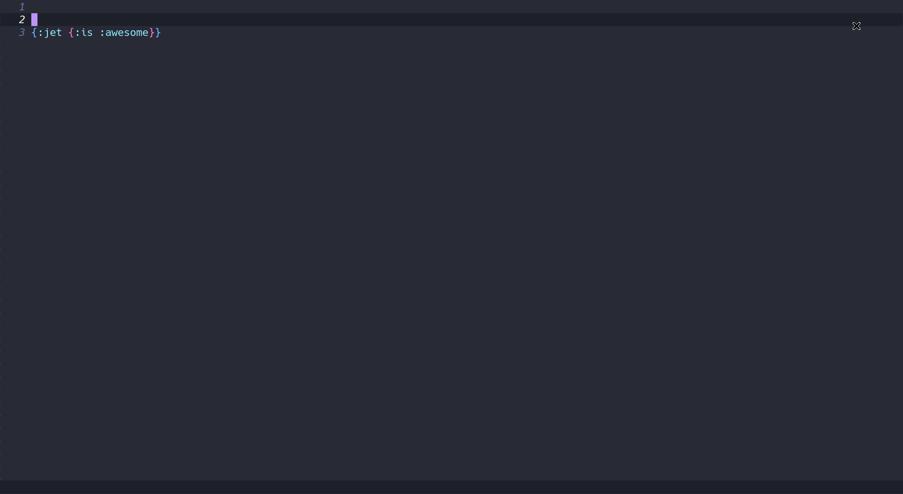

[](https://melpa.org/#/jet)

# jet.el

_Run [jet](https://github.com/borkdude/jet) Clojure tool from Emacs using a **smooth interface**_



## Installation

You can install from MELPA with package.el:

```
M-x package-install jet
```

## Usage

The main command is `M-x jet` which presents a magit-like interface where you can customize the args and choose lots of options like:

- Run jet and print to messages buffer (`jet-print`)
- Run jet and paste to current cursor (`jet-paste-cursor`)
- Run jet and paste to another buffer (`jet-paste-buffer`)
- Run jet and copy to clipboard (`jet-to-clipboard`)

Check the gif for an example.

Besides the main command it's possible to run each action directly as command, like `jet-paste-cursor` which will call jet directly passing the the region and checking the variable `jet-default-args`, useful for creating bindings for most used commands.
